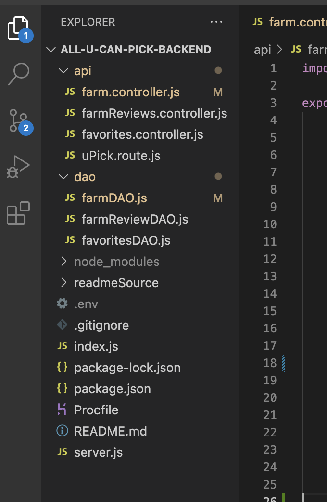
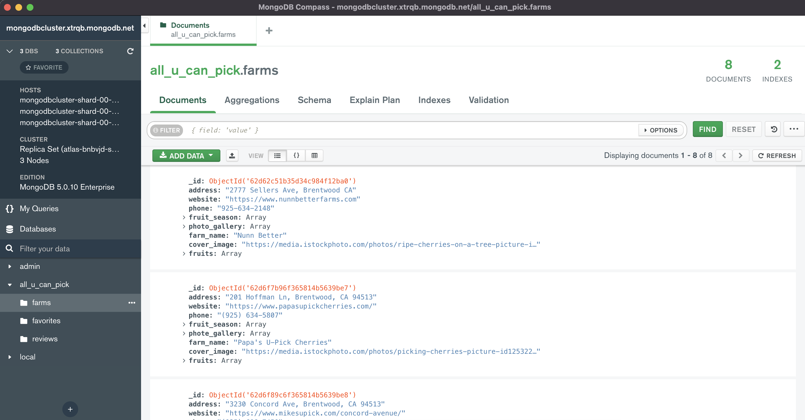
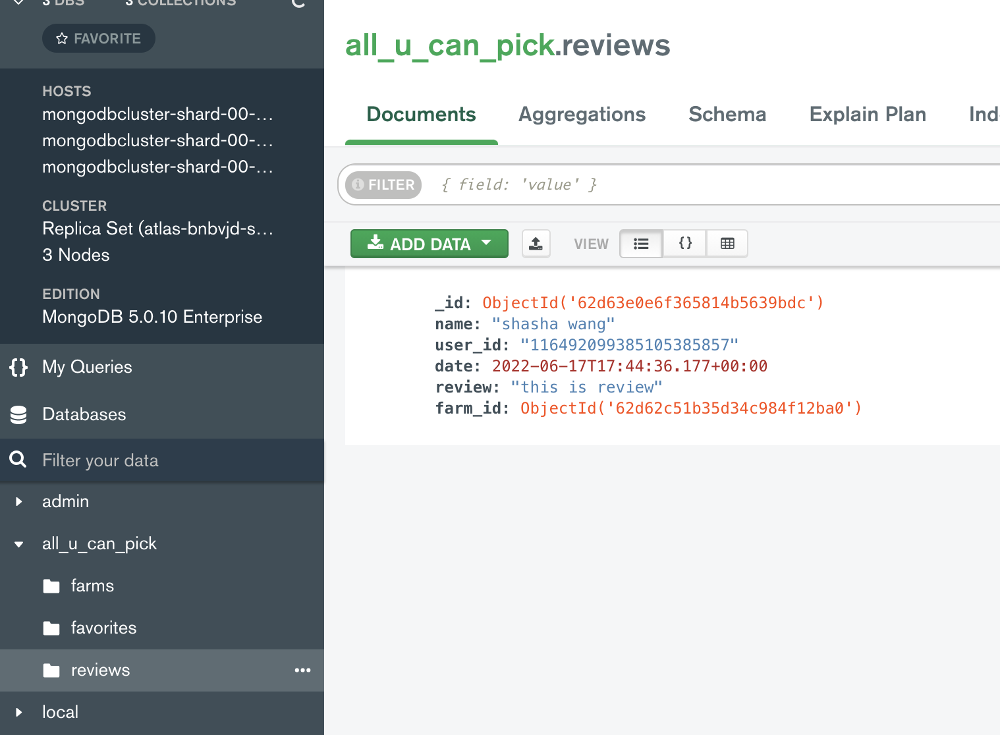
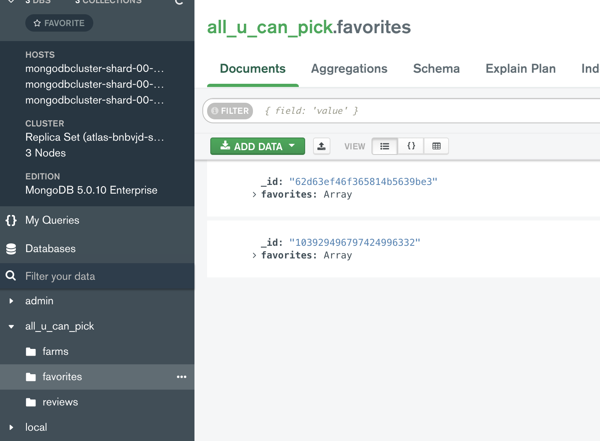
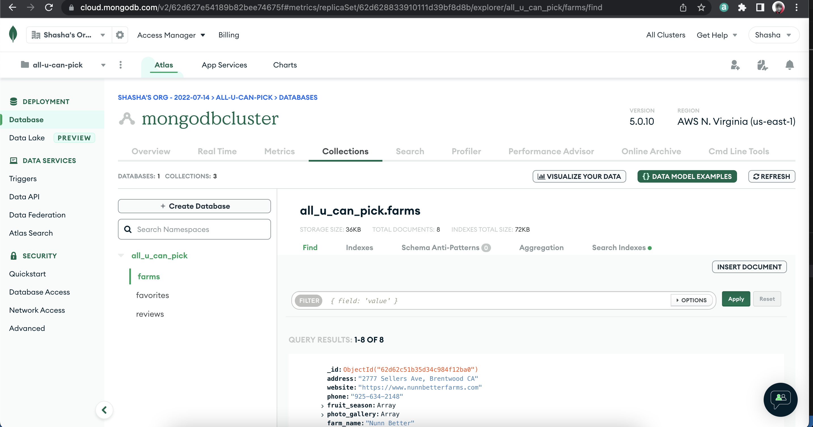
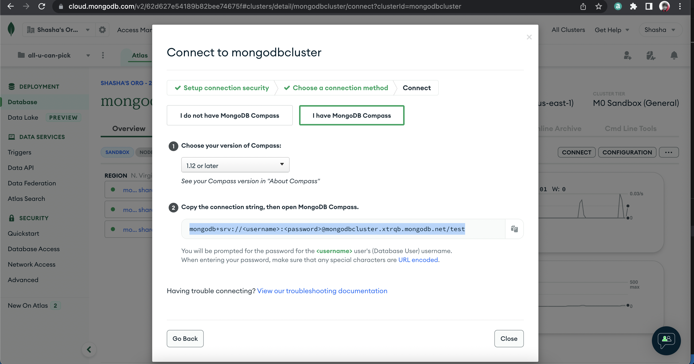

# all-u-can-pick-backend
Heroku address: https://all-u-can-pick-backend.herokuapp.com/
## Iteration 1 - Laying the groundwork for the backend

## Iteration 1 - Design MongoDB schema 
### MongoDB farm collection

### MongoDB review collection

### MongoDB favorite collection

## Iteration 1 - Set up Cloud MongoDB on Atlas
  

